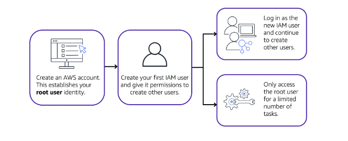
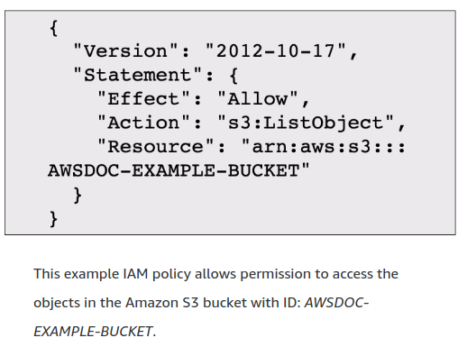

# IAM

## Users, Permission and Access

- Study the diagram carefully to know about best practices.

## IAM User

- IAM User is identity that you can crete in AWS which has name and credentials.
- It represents either the person or application that interacting AWS services.
- You should create individual IAM users for each person who needs to access AWS even if you have multiple employees who require the same level of acces.
- Tags are used to facilitate attribute-based access control for IAM users. It allows access to resources to be granted based on an attribute with an entity. This feature is useful where the access required is temporary or project-based.

## IAM Policies

- An IAM policy is a document that allows or denies permission to AWS services and resources.
- IAM policies enable you to customize users’ levels of access to resources.
- It is recommended the security principle of least privilege when granting permissions.

## IAM Groups

- IAM group is a collection of IAM users.
- When you assign an IAM policy to a group, all users in the group are granted permissions specified by the policy.
- Assigning IAM policies at the group level also makes it easier to adjust permissions when an employee transfers to a different job.

## IAM Role

- An IAM role is an identity that you can assume to gain temporary access to permissions. 
- Before an IAM user, application, or service can assume an IAM role, they must be granted permissions to switch to the role. 
- When someone assumes an IAM role, they abandon all previous permissions that they had under a previous role and assume the permissions of the new role.
- You can also enable MFA(Multi Factor Authentication) for the root user and IAM users.

